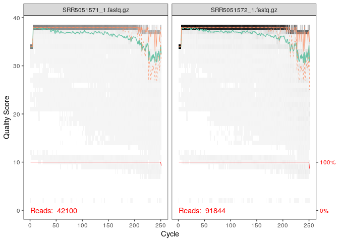
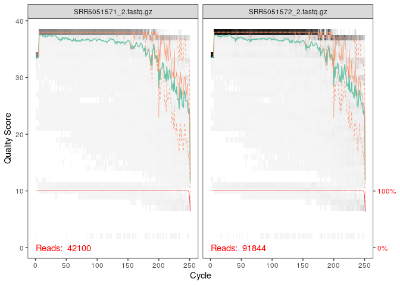
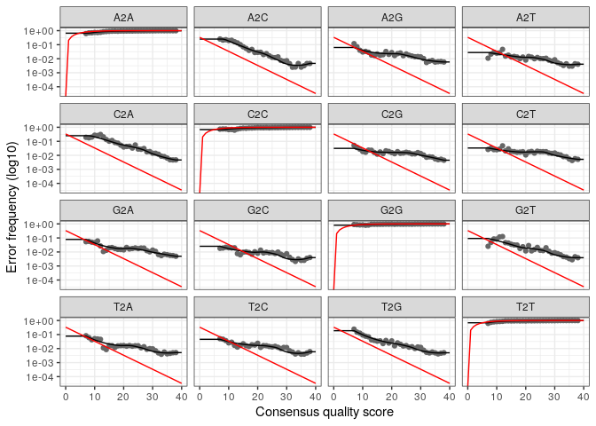
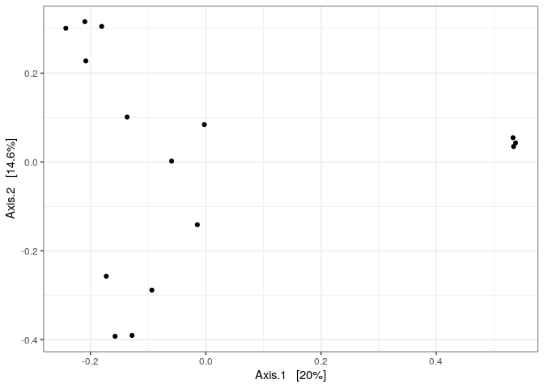
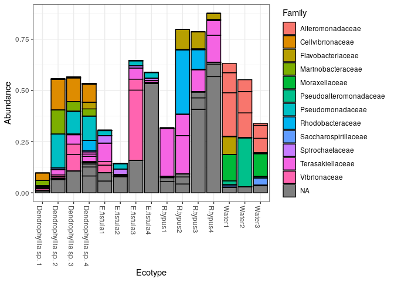

CC3 analyse
================

  - [Preparation](#preparation)
  - [Score de qualité des reads](#score-de-qualité-des-reads)
  - [Filtration des données](#filtration-des-données)
  - [Modèle d’erreur](#modèle-derreur)
  - [Inférence d’échantillon](#inférence-déchantillon)
  - [Fusionner les reads appariées](#fusionner-les-reads-appariées)
  - [Construire une table de
    séquence](#construire-une-table-de-séquence)
  - [Supprimer les chimères](#supprimer-les-chimères)
  - [Suivre les reads dans la
    pipeline](#suivre-les-reads-dans-la-pipeline)
  - [Assigniation taxonomique](#assigniation-taxonomique)
  - [Camembert](#camembert)

# Preparation

``` r
# Appel la library
library(dada2)
```

    ## Loading required package: Rcpp

``` r
# Charge les données de DADA2 enregistré précedemment 
load("03_analyse_FinalEnv")
```

``` r
#Importer les jeux de données dans paths
path <- "~/cc3_DADA_import/CC3"
list.files(path)
```

    ##  [1] "filtered"              "SRR5051571_1.fastq.gz" "SRR5051571_2.fastq.gz"
    ##  [4] "SRR5051572_1.fastq.gz" "SRR5051572_2.fastq.gz" "SRR5051573_1.fastq.gz"
    ##  [7] "SRR5051573_2.fastq.gz" "SRR5051574_1.fastq.gz" "SRR5051574_2.fastq.gz"
    ## [10] "SRR5051575_1.fastq.gz" "SRR5051575_2.fastq.gz" "SRR5051576_1.fastq.gz"
    ## [13] "SRR5051576_2.fastq.gz" "SRR5051577_1.fastq.gz" "SRR5051577_2.fastq.gz"
    ## [16] "SRR5051578_1.fastq.gz" "SRR5051578_2.fastq.gz" "SRR5051579_1.fastq.gz"
    ## [19] "SRR5051579_2.fastq.gz" "SRR5051580_1.fastq.gz" "SRR5051580_2.fastq.gz"
    ## [22] "SRR5051581_1.fastq.gz" "SRR5051581_2.fastq.gz" "SRR5051582_1.fastq.gz"
    ## [25] "SRR5051582_2.fastq.gz" "SRR5051583_1.fastq.gz" "SRR5051583_2.fastq.gz"
    ## [28] "SRR5051584_1.fastq.gz" "SRR5051584_2.fastq.gz" "SRR5051585_1.fastq.gz"
    ## [31] "SRR5051585_2.fastq.gz"

``` r
fnFs <- sort(list.files(path, pattern="1.fastq", full.names = TRUE))
fnRs <- sort(list.files(path, pattern="2.fastq", full.names = TRUE))
sample.namesfnFs <- sapply(strsplit(basename(fnFs), "\\."), `[`, 1)
sample.namesfnRs <- sapply(strsplit(basename(fnRs), "\\."), `[`, 1)
sample.namesfnFs
```

    ##  [1] "SRR5051571_1" "SRR5051572_1" "SRR5051573_1" "SRR5051574_1" "SRR5051575_1"
    ##  [6] "SRR5051576_1" "SRR5051577_1" "SRR5051578_1" "SRR5051579_1" "SRR5051580_1"
    ## [11] "SRR5051581_1" "SRR5051582_1" "SRR5051583_1" "SRR5051584_1" "SRR5051585_1"

``` r
sample.namesfnRs
```

    ##  [1] "SRR5051571_2" "SRR5051572_2" "SRR5051573_2" "SRR5051574_2" "SRR5051575_2"
    ##  [6] "SRR5051576_2" "SRR5051577_2" "SRR5051578_2" "SRR5051579_2" "SRR5051580_2"
    ## [11] "SRR5051581_2" "SRR5051582_2" "SRR5051583_2" "SRR5051584_2" "SRR5051585_2"

On sépare maintenant les R1 et les R2, pour cela on créer une variable
FnFs qui contiendra les R1 et fnRs qui contiendra les R2.

# Score de qualité des reads

``` r
plotQualityProfile(fnFs[1:2])
```

<!-- -->

``` r
plotQualityProfile(fnRs[1:2])
```

<!-- --> La
fonction plotQualityProfile permet de créer une graphique permettant de
visualiser les scores de qualités.  
En abscisse nous avons la position des paires de bases allant de 0 à 250
pb. En ordonnée nous avons le score de qualité. La ligne en vert
correspond au score de qualité moyen pour chaque position. La ligne en
rouge correspond au seuil où le score de qualité est de 10. La ligne en
orange correspond a quartile de la distribution du score de qualité.
Concernant les R1, on peut voir que en général le score de qualité est
plutot bon, on descend pas en dessous du Q30 à peu près à la position
240pb. Concernant les R2, on descend en dessous du Q30 a partir de la
position 200pb.

# Filtration des données

``` r
# Placer les fichiers filtrés dans filtré
filtFs <- file.path(path, "filtered", paste0(sample.namesfnFs, "_R1.fastq"))
filtRs <- file.path(path, "filtered", paste0(sample.namesfnRs, "_R2.fastq"))
names(filtFs) <- sample.namesfnFs
names(filtRs) <- sample.namesfnRs
filtFs
```

    ##                                           SRR5051571_1 
    ## "~/cc3_DADA_import/CC3/filtered/SRR5051571_1_R1.fastq" 
    ##                                           SRR5051572_1 
    ## "~/cc3_DADA_import/CC3/filtered/SRR5051572_1_R1.fastq" 
    ##                                           SRR5051573_1 
    ## "~/cc3_DADA_import/CC3/filtered/SRR5051573_1_R1.fastq" 
    ##                                           SRR5051574_1 
    ## "~/cc3_DADA_import/CC3/filtered/SRR5051574_1_R1.fastq" 
    ##                                           SRR5051575_1 
    ## "~/cc3_DADA_import/CC3/filtered/SRR5051575_1_R1.fastq" 
    ##                                           SRR5051576_1 
    ## "~/cc3_DADA_import/CC3/filtered/SRR5051576_1_R1.fastq" 
    ##                                           SRR5051577_1 
    ## "~/cc3_DADA_import/CC3/filtered/SRR5051577_1_R1.fastq" 
    ##                                           SRR5051578_1 
    ## "~/cc3_DADA_import/CC3/filtered/SRR5051578_1_R1.fastq" 
    ##                                           SRR5051579_1 
    ## "~/cc3_DADA_import/CC3/filtered/SRR5051579_1_R1.fastq" 
    ##                                           SRR5051580_1 
    ## "~/cc3_DADA_import/CC3/filtered/SRR5051580_1_R1.fastq" 
    ##                                           SRR5051581_1 
    ## "~/cc3_DADA_import/CC3/filtered/SRR5051581_1_R1.fastq" 
    ##                                           SRR5051582_1 
    ## "~/cc3_DADA_import/CC3/filtered/SRR5051582_1_R1.fastq" 
    ##                                           SRR5051583_1 
    ## "~/cc3_DADA_import/CC3/filtered/SRR5051583_1_R1.fastq" 
    ##                                           SRR5051584_1 
    ## "~/cc3_DADA_import/CC3/filtered/SRR5051584_1_R1.fastq" 
    ##                                           SRR5051585_1 
    ## "~/cc3_DADA_import/CC3/filtered/SRR5051585_1_R1.fastq"

``` r
filtRs
```

    ##                                           SRR5051571_2 
    ## "~/cc3_DADA_import/CC3/filtered/SRR5051571_2_R2.fastq" 
    ##                                           SRR5051572_2 
    ## "~/cc3_DADA_import/CC3/filtered/SRR5051572_2_R2.fastq" 
    ##                                           SRR5051573_2 
    ## "~/cc3_DADA_import/CC3/filtered/SRR5051573_2_R2.fastq" 
    ##                                           SRR5051574_2 
    ## "~/cc3_DADA_import/CC3/filtered/SRR5051574_2_R2.fastq" 
    ##                                           SRR5051575_2 
    ## "~/cc3_DADA_import/CC3/filtered/SRR5051575_2_R2.fastq" 
    ##                                           SRR5051576_2 
    ## "~/cc3_DADA_import/CC3/filtered/SRR5051576_2_R2.fastq" 
    ##                                           SRR5051577_2 
    ## "~/cc3_DADA_import/CC3/filtered/SRR5051577_2_R2.fastq" 
    ##                                           SRR5051578_2 
    ## "~/cc3_DADA_import/CC3/filtered/SRR5051578_2_R2.fastq" 
    ##                                           SRR5051579_2 
    ## "~/cc3_DADA_import/CC3/filtered/SRR5051579_2_R2.fastq" 
    ##                                           SRR5051580_2 
    ## "~/cc3_DADA_import/CC3/filtered/SRR5051580_2_R2.fastq" 
    ##                                           SRR5051581_2 
    ## "~/cc3_DADA_import/CC3/filtered/SRR5051581_2_R2.fastq" 
    ##                                           SRR5051582_2 
    ## "~/cc3_DADA_import/CC3/filtered/SRR5051582_2_R2.fastq" 
    ##                                           SRR5051583_2 
    ## "~/cc3_DADA_import/CC3/filtered/SRR5051583_2_R2.fastq" 
    ##                                           SRR5051584_2 
    ## "~/cc3_DADA_import/CC3/filtered/SRR5051584_2_R2.fastq" 
    ##                                           SRR5051585_2 
    ## "~/cc3_DADA_import/CC3/filtered/SRR5051585_2_R2.fastq"

Ici on va ranger les fichiers dans un dossier nommé filtered contenant
les objets filtFs et filtRs.

``` r
out <- filterAndTrim(fnFs, filtFs, fnRs, filtRs, trimLeft = 21, truncLen=c(240,200),
              maxN=0, maxEE=c(2,2), truncQ=2, rm.phix=TRUE,
              compress=TRUE, multithread=TRUE)
head(out)
```

    ##                       reads.in reads.out
    ## SRR5051571_1.fastq.gz    42100     37487
    ## SRR5051572_1.fastq.gz    91844     82427
    ## SRR5051573_1.fastq.gz    71431     63837
    ## SRR5051574_1.fastq.gz     6908      6147
    ## SRR5051575_1.fastq.gz    16618     14812
    ## SRR5051576_1.fastq.gz    49581     44467

La fonction filterAndTrim permet de filtrer et couper les R1 et les
R2.  
La fonction trimLeft = 21 permet d’éliminer les primers pour les reads
Forward et les reads Reverse. la fonction truncLen permet d’éliminer les
nucléotides en position 240pb et 200pb pour conserver le meilleure score
qualité pour les reads(au dessus du Q30). maxEE permet de recalculer le
Qscore moyen apres avoir coupé une partie du read incriminé. MaxN=0
permet d’enlever toutes les bases dans lesquelles il y aura un N (A,T,G
ou C) dans un read d’un jeu de données (le R1 et le R2). On peut voir
qu’on a pas perdu beaucoup de read après la filtration.

# Modèle d’erreur

DADA2 calcul un model d’erreur à partir des données de séquençage. On
applique cette méthode sur les reads forward puis reverse

``` r
errF <- learnErrors(filtFs, multithread=TRUE)
```

    ## 110950218 total bases in 506622 reads from 11 samples will be used for learning the error rates.

``` r
errR <- learnErrors(filtRs, multithread=TRUE)
```

    ## 112636645 total bases in 629255 reads from 13 samples will be used for learning the error rates.

``` r
plotErrors(errF, nominalQ=TRUE)
```

    ## Warning: Transformation introduced infinite values in continuous y-axis

<!-- -->
DADA2 analyse les variations de séquences et il va identifier et créer
un modèle d’erreur grâce a la fonction learnErrors. Ce modèle d’erreur
sera ensuite utiliser afin de corriger les reads du jeu de données.

Ce qu’on observe ici est un plot du modèle d’erreur généré par DADA2. En
abscisse nous avont le Qscore et en ordonner la probabilité. On obtient
donc la probabilité d’une mutation en fonction du Qscore. Pour A2A, la
pobabilité qu’un A devient un A est très forte. Pour A2C, lorsque le
Qscore est très élevé, la probabilité qu’un A devient un C est faible.
Si le Qscore est faible, la probablité qu’un A donne un C est élevé. A
l’inverse si le Qscore est élevé alors la probabilité qu’un A donne un
C est faible. La courbe en noir correspond au modèle d’erreur généré par
DADA2.

# Inférence d’échantillon

``` r
dadaFs <- dada(filtFs, err=errF, multithread=TRUE)
```

    ## Sample 1 - 37487 reads in 9365 unique sequences.
    ## Sample 2 - 82427 reads in 25594 unique sequences.
    ## Sample 3 - 63837 reads in 17720 unique sequences.
    ## Sample 4 - 6147 reads in 1954 unique sequences.
    ## Sample 5 - 14812 reads in 4702 unique sequences.
    ## Sample 6 - 44467 reads in 10034 unique sequences.
    ## Sample 7 - 32759 reads in 11542 unique sequences.
    ## Sample 8 - 20881 reads in 9557 unique sequences.
    ## Sample 9 - 33751 reads in 12928 unique sequences.
    ## Sample 10 - 81111 reads in 14166 unique sequences.
    ## Sample 11 - 88943 reads in 19569 unique sequences.
    ## Sample 12 - 51359 reads in 12025 unique sequences.
    ## Sample 13 - 71274 reads in 12748 unique sequences.
    ## Sample 14 - 45613 reads in 11988 unique sequences.
    ## Sample 15 - 86941 reads in 22924 unique sequences.

``` r
dadaRs <- dada(filtRs, err=errR, multithread=TRUE)
```

    ## Sample 1 - 37487 reads in 8298 unique sequences.
    ## Sample 2 - 82427 reads in 21546 unique sequences.
    ## Sample 3 - 63837 reads in 14556 unique sequences.
    ## Sample 4 - 6147 reads in 1818 unique sequences.
    ## Sample 5 - 14812 reads in 3681 unique sequences.
    ## Sample 6 - 44467 reads in 8308 unique sequences.
    ## Sample 7 - 32759 reads in 11500 unique sequences.
    ## Sample 8 - 20881 reads in 7502 unique sequences.
    ## Sample 9 - 33751 reads in 10000 unique sequences.
    ## Sample 10 - 81111 reads in 13592 unique sequences.
    ## Sample 11 - 88943 reads in 17325 unique sequences.
    ## Sample 12 - 51359 reads in 8526 unique sequences.
    ## Sample 13 - 71274 reads in 10946 unique sequences.
    ## Sample 14 - 45613 reads in 10067 unique sequences.
    ## Sample 15 - 86941 reads in 21351 unique sequences.

L’objet dadaFs reçoit le modèle d’erreur pour les reads forward et
l’objet dadaRs reçoit le modèle d’erreur pour les reads revers Pour le
1er échantillon, on avait 37487 reads et 8298 séquence unique avant la
correction par DADA2.

# Fusionner les reads appariées

Aligner les R1 et les R2 en un contigs

``` r
mergers <- mergePairs(dadaFs, filtFs, dadaRs, filtRs, verbose=TRUE)
```

    ## 36815 paired-reads (in 267 unique pairings) successfully merged out of 37217 (in 391 pairings) input.

    ## 75965 paired-reads (in 538 unique pairings) successfully merged out of 80643 (in 2417 pairings) input.

    ## 59816 paired-reads (in 368 unique pairings) successfully merged out of 62738 (in 1542 pairings) input.

    ## 5785 paired-reads (in 118 unique pairings) successfully merged out of 6018 (in 174 pairings) input.

    ## 13757 paired-reads (in 183 unique pairings) successfully merged out of 14312 (in 367 pairings) input.

    ## 43077 paired-reads (in 404 unique pairings) successfully merged out of 44015 (in 597 pairings) input.

    ## 29436 paired-reads (in 604 unique pairings) successfully merged out of 31537 (in 1319 pairings) input.

    ## 17685 paired-reads (in 227 unique pairings) successfully merged out of 19524 (in 1083 pairings) input.

    ## 31157 paired-reads (in 595 unique pairings) successfully merged out of 32774 (in 943 pairings) input.

    ## 77099 paired-reads (in 360 unique pairings) successfully merged out of 80105 (in 844 pairings) input.

    ## 88111 paired-reads (in 321 unique pairings) successfully merged out of 88566 (in 464 pairings) input.

    ## 49389 paired-reads (in 188 unique pairings) successfully merged out of 50677 (in 617 pairings) input.

    ## 68206 paired-reads (in 209 unique pairings) successfully merged out of 69958 (in 723 pairings) input.

    ## 42618 paired-reads (in 250 unique pairings) successfully merged out of 44634 (in 907 pairings) input.

    ## 84482 paired-reads (in 924 unique pairings) successfully merged out of 86134 (in 1296 pairings) input.

La commande mergePairs permet la formation de contigs seulement quand
cela est possible. Cela permet de reconstruire la région hyper variable
de l’ARN 16S.

# Construire une table de séquence

``` r
# Fait une table de sequence et l'affiche
seqtab <- makeSequenceTable(mergers)
dim(seqtab)
```

    ## [1]   15 3703

On a créer un objet seqtable et de dans on y met une matrice
d’observation de l’objet mergers grâce a la fonction
makeSequenceTable. la fonction dim permet d’avoir la dimension du
tableau. Le nombre 15 correspond aux lignes et le nombre 3703 correspond
aux colonnes.

``` r
# Inspecte la distribution des longueurs de séquence
table(nchar(getSequences(seqtab)))
```

    ## 
    ## 219 233 239 240 241 242 243 244 245 246 247 248 249 250 251 252 253 254 255 256 
    ##   1   6   1  13  10   7   2  17  49 102  69  84  98 106 293 885 570 430 420 197 
    ## 257 258 259 260 261 262 263 264 265 266 268 270 271 272 278 279 282 294 299 316 
    ##  69  64  74  35  19  23   1  38   3   1   1   1   1   1   2   1   1   6   1   1

A partir de seqtab on va pouvoir savoir combien de fois on retrouve une
séquence a une certaine longueur en nucléotide. Les reads sont répartis
sur une plage assez resteinte. La majorité des reads ont une longueur de
252 pb.

# Supprimer les chimères

Une séquence chimère est une séquence d’ADN polymérisé par PCR mais qui
n’a pas fini de se polymériser.

``` r
seqtab.nochim <- removeBimeraDenovo(seqtab, method="consensus", multithread=TRUE, verbose=TRUE)
```

    ## Identified 199 bimeras out of 3703 input sequences.

``` r
dim(seqtab.nochim)
```

    ## [1]   15 3504

Les séquences chimériques doivent être éliminés du jeu de données sinon
cela peut entrainer des erreurs lors de nos analyses. l’objet
seqtab.nochim est créée dans lequel la fonction removeBineraDenovo
permet de supprimer les séquences chimériques. Ici nous avons identifié
199 chimères sur les 3703 séquences. Dans l’article, les chimères ont
été éliminées en utilisant UCHIME.

``` r
sum(seqtab.nochim)/sum(seqtab)
```

    ## [1] 0.9887517

``` r
1-sum(seqtab.nochim)/sum(seqtab)
```

    ## [1] 0.0112483

Il y avait 1,1% des séquences qui était des séquences chimérique, celle
ci ont donc était retiré du jeu de données.

# Suivre les reads dans la pipeline

``` r
getN <- function(x) sum(getUniques(x))
track <- cbind(out, sapply(dadaFs, getN), sapply(dadaRs, getN), sapply(mergers, getN), rowSums(seqtab.nochim))
colnames(track) <- c("input", "filtered", "denoisedF", "denoisedR", "merged", "nonchim")
rownames(track) <- sample.namesfnFs
head(track)
```

    ##              input filtered denoisedF denoisedR merged nonchim
    ## SRR5051571_1 42100    37487     37357     37334  36815   36600
    ## SRR5051572_1 91844    82427     81075     81832  75965   73900
    ## SRR5051573_1 71431    63837     63017     63428  59816   57644
    ## SRR5051574_1  6908     6147      6079      6056   5785    5778
    ## SRR5051575_1 16618    14812     14526     14529  13757   13699
    ## SRR5051576_1 49581    44467     44173     44264  43077   42959

L’objet track correspond aux séquences après chaque étapes d’analyse
réalisé ici. Pour SRR5051571\_1 on passe de 42100 à 36815 séquences.

# Assigniation taxonomique

Nous allons assigner une taxonomie à nos taxons grâce à silva. Cette
assignation taxonomique est déposée dans l’objet taxa.

``` r
# Assigniation Taxonomique
taxa <- assignTaxonomy(seqtab.nochim, "~/cc3_DADA_import/silva_nr99_v138_train_set.fa.gz", multithread=TRUE)
```

``` r
taxa.print <- taxa
rownames(taxa.print) <- NULL
head(taxa.print)
```

    ##      Kingdom    Phylum           Class                 Order             
    ## [1,] "Bacteria" "Proteobacteria" "Gammaproteobacteria" NA                
    ## [2,] "Bacteria" "Bacteroidota"   "Bacteroidia"         "Flavobacteriales"
    ## [3,] "Bacteria" "Proteobacteria" "Gammaproteobacteria" NA                
    ## [4,] "Bacteria" "Proteobacteria" "Alphaproteobacteria" "Rhodobacterales" 
    ## [5,] "Bacteria" "Proteobacteria" "Alphaproteobacteria" "Rhodospirillales"
    ## [6,] "Bacteria" "Proteobacteria" "Gammaproteobacteria" "Alteromonadales" 
    ##      Family             Genus        
    ## [1,] NA                 NA           
    ## [2,] NA                 NA           
    ## [3,] NA                 NA           
    ## [4,] "Rhodobacteraceae" NA           
    ## [5,] "Terasakiellaceae" NA           
    ## [6,] "Alteromonadaceae" "Alteromonas"

Ici nous pouvons inspecter les affectations taxonomiques. Les
attributions vont rarement jusqu’à l’espèce car il est souvent
impossible de faire des assignations d’espèces sans ambiguité à partir
d’un fragment du gène 16S. L’assignation s’arrête donc souvent à la
famille et parfois au genre.

``` r
# Appel des library
library(phyloseq); packageVersion("phyloseq")
```

    ## [1] '1.32.0'

``` r
library(Biostrings); packageVersion("Biostrings")
```

    ## Loading required package: BiocGenerics

    ## Loading required package: parallel

    ## 
    ## Attaching package: 'BiocGenerics'

    ## The following objects are masked from 'package:parallel':
    ## 
    ##     clusterApply, clusterApplyLB, clusterCall, clusterEvalQ,
    ##     clusterExport, clusterMap, parApply, parCapply, parLapply,
    ##     parLapplyLB, parRapply, parSapply, parSapplyLB

    ## The following objects are masked from 'package:stats':
    ## 
    ##     IQR, mad, sd, var, xtabs

    ## The following objects are masked from 'package:base':
    ## 
    ##     anyDuplicated, append, as.data.frame, basename, cbind, colnames,
    ##     dirname, do.call, duplicated, eval, evalq, Filter, Find, get, grep,
    ##     grepl, intersect, is.unsorted, lapply, Map, mapply, match, mget,
    ##     order, paste, pmax, pmax.int, pmin, pmin.int, Position, rank,
    ##     rbind, Reduce, rownames, sapply, setdiff, sort, table, tapply,
    ##     union, unique, unsplit, which, which.max, which.min

    ## Loading required package: S4Vectors

    ## Loading required package: stats4

    ## 
    ## Attaching package: 'S4Vectors'

    ## The following object is masked from 'package:base':
    ## 
    ##     expand.grid

    ## Loading required package: IRanges

    ## 
    ## Attaching package: 'IRanges'

    ## The following object is masked from 'package:phyloseq':
    ## 
    ##     distance

    ## Loading required package: XVector

    ## 
    ## Attaching package: 'Biostrings'

    ## The following object is masked from 'package:base':
    ## 
    ##     strsplit

    ## [1] '2.56.0'

``` r
library(ggplot2); packageVersion("ggplot2")
```

    ## [1] '3.3.3'

La library permet d’activer la bibliothèque indiquée. La fonction
packageVersion permet de visualiser la version du package.

``` r
theme_set(theme_bw())
```

``` r
# Construction d'un tableau
samples.out <- rownames(seqtab.nochim)
coral_metadata <- read.delim("SraRunTable.txt", header = TRUE, sep = ",")

ecotype <- sapply(strsplit(coral_metadata$Sample.Name, "_"), `[`, 1)

samdf <- data.frame(Ecotype=ecotype)
rownames(samdf) <- samples.out
samdf
```

    ##                          Ecotype
    ## SRR5051571_1 Dendrophyllia sp. 3
    ## SRR5051572_1              Water3
    ## SRR5051573_1              Water1
    ## SRR5051574_1 Dendrophyllia sp. 2
    ## SRR5051575_1          E.fistula3
    ## SRR5051576_1          E.fistula4
    ## SRR5051577_1 Dendrophyllia sp. 1
    ## SRR5051578_1            R.typus1
    ## SRR5051579_1          E.fistula2
    ## SRR5051580_1            R.typus3
    ## SRR5051581_1 Dendrophyllia sp. 4
    ## SRR5051582_1            R.typus2
    ## SRR5051583_1            R.typus4
    ## SRR5051584_1              Water2
    ## SRR5051585_1          E.fistula1

Ce tableau permet de faire correspondre le nom du fichier avec
l’ecotype.

``` r
# Création d'un objet ps
ps <- phyloseq(otu_table(seqtab.nochim, taxa_are_rows=FALSE), 
               sample_data(samdf), 
               tax_table(taxa))
ps
```

    ## phyloseq-class experiment-level object
    ## otu_table()   OTU Table:         [ 3504 taxa and 15 samples ]
    ## sample_data() Sample Data:       [ 15 samples by 1 sample variables ]
    ## tax_table()   Taxonomy Table:    [ 3504 taxa by 6 taxonomic ranks ]

taxtab, samdf et seqtab sont regroupés dans l’objet ps. On peut voir
combien de séquences sont identifiés dans chaque échantillon. Par
exemple nous avons 3504 taxa qui sont répartis en 15 échantillons et
dans les 15 échantillons nous avons 1 variables.

Dans l’article les indices de diversité alpha (Chao1, Simpson Evenness
et Inverse Simpson Index) ont été calculés à l’aide de mothur. Les
lignes de codes ne trouve pas les fonctions Chao1 et evenness Simpson.
Je n’ai pas reussi a trouvé comment il fallait faire, je n’ai donc pas
reussi a reproduire le tableau avec les valeurs pour les indices de
diversité alpha.

``` r
library(vegan)
```

    ## Loading required package: permute

    ## Loading required package: lattice

    ## This is vegan 2.5-7

``` r
library(permute)
library(lattice)
#chao1(pslog, taxa.row = TRUE)
```

``` r
#evenness(pslog)
```

``` r
library(plyr)
```

    ## 
    ## Attaching package: 'plyr'

    ## The following object is masked from 'package:XVector':
    ## 
    ##     compact

    ## The following object is masked from 'package:IRanges':
    ## 
    ##     desc

    ## The following object is masked from 'package:S4Vectors':
    ## 
    ##     rename

``` r
#ddply(data,~Sites,function(x) {samdf(SIMPSON=diversity(x[-1], index="simpson")/log(sum(x[-1]>0))) })
```

``` r
library(plyr)
 #ddply(data,~Sites,function(x) {samdf(SIMPSON=diversity(x[-1], index="simpson")) })
```

J’ai tenté ces lignes de code sans succès.

``` r
dna <- Biostrings::DNAStringSet(taxa_names(ps))
names(dna) <- taxa_names(ps)
ps <- merge_phyloseq(ps, dna)
taxa_names(ps) <- paste0("ASV", seq(ntaxa(ps)))
ps
```

    ## phyloseq-class experiment-level object
    ## otu_table()   OTU Table:         [ 3504 taxa and 15 samples ]
    ## sample_data() Sample Data:       [ 15 samples by 1 sample variables ]
    ## tax_table()   Taxonomy Table:    [ 3504 taxa by 6 taxonomic ranks ]
    ## refseq()      DNAStringSet:      [ 3504 reference sequences ]

``` r
pslog <- transform_sample_counts(ps, function(x) log(1 + x))
out.wuf.log <- ordinate(pslog, method = "PCoA", distance = "bray")
```

La fonction transform\_sample\_counts permet de transformer les données
d’abondance en une OTU\_table. On va construire une PCoA en utilisant la
distance bray-Curtis afin d’évaluer la dissimilarité entre les taxons.
Dans l’article les différences de diversité beta ont été visualisées
avec une PCoA basée sur une matrice de dissimilarité de Bray\_Curtis et
une corrélation de Pearson.

``` r
plot_ordination(pslog, out.wuf.log, shape = "Ecotype")
```

    ## Warning in plot_ordination(pslog, out.wuf.log, shape = "Ecotype"): Shape
    ## variable was not found in the available data you provided.No shape mapped.

    ## No available covariate data to map on the points for this plot `type`

<!-- --> Ce
graphique est une PCoA (suivant une distance de Bray-Curtis). Les axes
correspondent aux variances c’est à dire à la distribution de la
communauté microbienne dans les échantillons. J’ai essayé de reproduire
le même graphique mais je n’ai pas reussi a obtenir une légende où
chaque shape correpondrait a un écotype (Dendrophylla sp, E. Fistula,
R.typus et Water), j’ai tenté de tout relancé, de modifier Ecotype par
d’autre chose, d’ajouté type = (“samples”, “sites”, “species”, “taxa”,
“biplot”, “split”, “scree”). Je n’ai donc pas reussi a résoudre le
problème : Shape variable was not found in the available data you
provided.No shape mapped.No available covariate data to map on the
points for this plot `type`

De plus mon graphique ne correspond pas a celui du papier. Soit mes
données sont mal traitées, soit la ligne de code est mal ecrite et ne
me permet pas d’avoir les mêmes résultats. Si nous comparons mes
résultats avec celui de papier on pourrait penser que les 3 petits rond
tout a droite (isolé) pourrait correspondre aux échantillons d’eau. On
observe quand même que certain rond sont plus proche entre eux que les
autres. Par exmple les rond tout en haut a droite on peut voir qu’ils
sont très regroupé par rapport aux autres. Cela pourrait peut être
correspond a E.fistula ou R. typus qui sont des échantillons très
regroupé entre eux mais cela est difficile a dire … Je ne peux pas bien
analysé ces données.

``` r
top20 <- names(sort(taxa_sums(ps), decreasing=TRUE))[1:26]
ps.top20 <- transform_sample_counts(ps, function(OTU) OTU/sum(OTU))
ps.top20 <- prune_taxa(top20, ps.top20)

ps
```

    ## phyloseq-class experiment-level object
    ## otu_table()   OTU Table:         [ 3504 taxa and 15 samples ]
    ## sample_data() Sample Data:       [ 15 samples by 1 sample variables ]
    ## tax_table()   Taxonomy Table:    [ 3504 taxa by 6 taxonomic ranks ]
    ## refseq()      DNAStringSet:      [ 3504 reference sequences ]

``` r
plot_bar(ps.top20, x="Ecotype", fill="Family")
```

<!-- -->

On réalise un diagramme en batonnet dans lequel on prend les 20
premières séquences. En ordonné nous avons les abondances pour chaque
Ecotype (Dendrophylla sp, E. Fistula, R.typus et Water) et en abscisse
nous avons l’ecotype. Les différentes couleurs correspondent a la
famille des microorganismes retrouvé dans l’ecotype.

Ici aussi les résutlats sont différent du papier, comme précement cela
peut être du a mes traitements de donnée ou a mes lignes de codes. Ici
les Na sont beaucoup moins abondant que ceux du papier. J’ai réussi a
obtenir en abscisse le nom des ecotypes et a obtenir une légende de
couleur qui correspond a une famille de bactérie. On retrouve certaines
familles comme par exemple : Pseudomonadaceae, Rhodobacteraeae,
Vibrionaceae, Moraxellaceae, Alteromonadaceae et Flavobacteriaceae qui
sont également retrouvé dans le papier.

On peut voir que pour l’échantillion d’eau de mer Alteromonadaceae est
très abondante et Pseudomonadaceae est moins abondant alors que sur la
papier c’est l’inverse.

Dans le papier on pouvait voir que la composition de la communauté
bactérienne dans les échantillons de corail était nettement différente
de celle des échantillons d’eau de mer. Dans mes résultats il
sembelerait que les échantillons d’eau de mer ont une composition de
communauté bactérienne différent de celle des échantillons de corail. On
peut également voir ici que la composition de la communauté microbienne
est spécifique pour chaque corail et l’abondance était également
différentes entre les coraux, comme dans le papier.

# Camembert

Je n’ai pas reussi a trouvé comment faire des camembert avec des données
de phyloseq malgrés mes recherches sur internet.

``` r
# Sauvegarde des données dans l'environnement afin de les réutiliser
save.image(file="03_analyse_FinalEnv")
```
